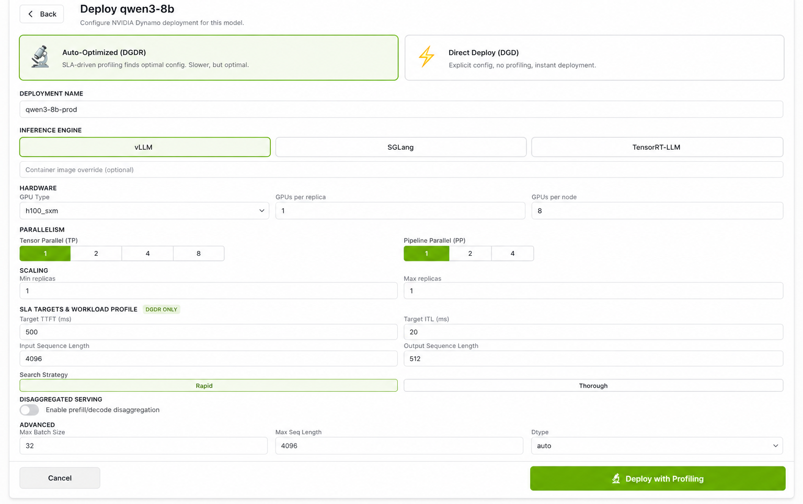

<!--
SPDX-FileCopyrightText: Copyright (c) 2025-2026 NVIDIA CORPORATION & AFFILIATES. All rights reserved.
SPDX-License-Identifier: Apache-2.0
-->

# DEP: Native REST APIs for Dynamo CRD Lifecycle Management

| Field           | Value                                                            |
| --------------- | ---------------------------------------------------------------- |
| **Area**        | external-api / k8s (cross-ref: dgdr)                             |
| **Status**      | Draft                                                            |
| **Authors**     | Kang Zhang (@kangclzjc), Anish Maddipoti (amaddipoti@nvidia.com) |
| **Created**     | 2026-06-05                                                       |
| **Detailed design** | Appendix A (non-normative); reference UI/UX in Appendix A.6 |

## Summary

Dynamo's Kubernetes operator exposes its deployment surface — `DynamoGraphDeployment`
(DGD), `DynamoGraphDeploymentRequest` (DGDR), `DynamoModel` (DM), and
`DynamoComponentDeployment` (DCD) — **only** through the Kubernetes API (`kubectl apply`,
client-go, Helm). There is no language-agnostic, OpenAPI-documented, auth-friendly HTTP
surface for *creating, reading, updating, deleting, and observing* these resources.

This DEP proposes **Governor** — the Dynamo control-plane API: a thin, stateless HTTP service that fronts the
existing CRDs with a versioned, OpenAPI-described contract, plus a **high-level `deploy`
endpoint** that translates a simplified, UI-friendly configuration into a fully-formed DGD or
DGDR custom resource. A reference **"Deploy a model" UI** in the NVIDIA visual style
(Appendix A.6) demonstrates the API and the intent → CR mapping end-to-end.

This document is a proposal: the normative content is §Proposal / §Requirements. Appendix A
captures implementation-level detail (endpoint shapes, schemas, error model, UI) for reviewers
who want it, and is expected to be refined in a follow-up design doc / the implementation PR.

## Motivation

### Today: every consumer re-implements the same Kubernetes glue

The operator is 100% Kubernetes-API native. Verified against
[`deploy/operator/cmd/main.go`](../../deploy/operator/cmd/main.go), the operator process
runs only a webhook server, a metrics server, and health probes — **there is no management
HTTP/REST listener**. Anyone building a product *on top* of Dynamo — an internal deploy
portal, a multi-tenant inference-as-a-service platform, a CI/CD pipeline, a thin CLI — must:

1. **Embed client-go (or a kube client in their language).** Non-Go ecosystems (TypeScript
   front-ends, Python automation, Java services) have no first-class path and fall back to
   shelling out to `kubectl` or hand-rolled API calls.
2. **Own a kubeconfig / broad in-cluster RBAC** with create/patch/delete rights on
   `nvidia.com` resources, and re-solve multi-tenancy (namespace scoping, per-tenant quota,
   audit) themselves.
3. **Re-derive the intent → CR translation.** Turning "deploy Llama-3.1-70B on H200, vLLM,
   disaggregated, TTFT ≤ 300 ms" into a valid DGD/DGDR — choosing `components`, the
   `type: prefill`/`type: decode` split, worker `args` for TP/PP/dtype, and the
   `hardware`/`workload`/`sla` blocks — is non-trivial domain knowledge that currently
   lives only in tribal examples ([`examples/`](../../examples/), `recipes/`).
4. **Poll `kubectl get -o json`** and parse `status.conditions` / `status.phase` /
   `status.profilingPhase` by hand to drive a UI.

### Evidence: duplicated translation drifts from the schema

Because the intent → CR translation is copied into each consumer, every copy drifts from the
CRD as the schema evolves — and it does evolve. The deployment API has already moved from
`nvidia.com/v1alpha1` (a `spec.services:` **map**) to the now-served `nvidia.com/v1beta1`
(a `spec.components:` **list**), changed how GPUs are requested (`resources.limits."nvidia.com/gpu"`) and constrains GPU types
to a controlled `GPUSKUType` enum. Any hand-written client not kept in lockstep silently emits
stale or invalid manifests — the old `services` map, a wrong GPU resource key, or a GPU SKU
the CRD does not accept.

This is exactly the cost a native API removes: the translation belongs in **one**
authoritative place that tracks the CRD, not copied into every consumer.

### Who is affected

- **Platform / portal builders** wanting a web "Deploy a model" experience.
- **Multi-tenant / SaaS** operators needing token-scoped, namespace-scoped access without
  distributing cluster credentials.
- **Non-Go automation** (TypeScript / Python / Java) and **thin CLIs**.
- **The Dynamo project itself**, which has no canonical, testable home for the intent → CR
  mapping.

### Goals

- A **versioned REST contract** (`/api/v1/…`) for the full lifecycle of Dynamo CRDs.
- A **canonical, server-side high-level `deploy` translation** so consumers stop
  re-implementing it.
- **First-class status/observability** (conditions, phase, replica counts, events) and
  **streaming** updates.
- A **machine-readable OpenAPI 3.x spec** served by the API.
- **AuthN/AuthZ that maps cleanly onto Kubernetes RBAC** with namespace/tenant scoping,
  without distributing kubeconfigs.
- A **reference UI/UX design** demonstrating the deploy form and the CR mapping.

### Non-goals

- Replacing the Kubernetes API or the operator's reconcile loop — this is a *facade*, not a
  new control plane. The operator remains the source of truth.
- Replacing the inference data plane (OpenAI-compatible `/v1/chat/completions` via the
  Inference Gateway / frontend) — see [`docs/kubernetes/inference-gateway.md`](../kubernetes/inference-gateway.md).
  This DEP is about the **management/control** plane only.
- Building a billing/usage/identity product — that is what downstream platforms layer on top.

## Proposal

### Architecture

```
            ┌────────────────────────┐        HTTPS / JSON (OpenAPI 3.x)
   Web UI ──┤                        │◄───────────────────────────── CLI / CI / SaaS
            │        Governor        │
  (React)   │   (stateless facade)   │  AuthN: bearer/OIDC   AuthZ: K8s RBAC (impersonation)
            └───────────┬────────────┘
                        │ kube-apiserver REST (served versions, Server-Side Apply)
                        ▼
                ┌───────────────┐   watch / reconcile  ┌──────────────────┐
                │  kube-apiserver│◄───────────────────►│ Dynamo Operator  │
                │  (CRDs + conv. │                      │ (controllers)    │
                │   webhook)     │                      └──────────────────┘
                └───────────────┘
```

**Governor** is **stateless**: it holds no database, derives all state from the Kubernetes API,
and scales horizontally. It is the single place where the intent → CR translation lives. The
operator's reconcile loop is unchanged and remains the source of truth.

### What the API exposes

The API fronts the existing CRDs with namespace-scoped REST resources
(`/api/v1/namespaces/{ns}/…`), targeting each CRD's **served** version (the conversion webhook
bridges to the storage version; see Appendix A.4):

| Resource             | CRD (kind)                              | Served apiVersion         | Verbs        |
| -------------------- | --------------------------------------- | ------------------------- | ------------ |
| Deployments          | `DynamoGraphDeployment`                 | `nvidia.com/v1beta1`      | CRUD         |
| Deployment Requests  | `DynamoGraphDeploymentRequest`          | `nvidia.com/v1beta1`      | CRUD         |
| Models               | `DynamoModel`                           | **`nvidia.com/v1alpha1`** | CRUD (registry: LoRA/adapter + endpoint discovery — **not** a deploy target) |
| Components           | `DynamoComponentDeployment`             | `nvidia.com/v1beta1`      | read-only    |
| Scaling Adapters     | `DynamoGraphDeploymentScalingAdapter`   | `nvidia.com/v1beta1`      | read-only (scale via the deployments `scale` action) |

On top of plain CRUD, the API offers a **high-level `deploy` endpoint**: it accepts a flat,
UI-friendly configuration and emits a complete **DGD** (direct) or **DGDR** (SLA / auto-optimized)
— the single, canonical home for the intent → CR translation consumers re-implement today. It
supports a two-level dry-run — **render-only** (translate and return the manifest, no cluster
contact) and **server-side** (a Kubernetes `dryRun=All` for real admission/CEL validation).
Status, events, a streaming watch (SSE), a `scale` action, and YAML export are exposed as
subresources. The route list, request schema, dry-run mechanics, and error model are in
Appendix A.1–A.3.

### Authentication & authorization

Authentication is a bearer token (a Kubernetes ServiceAccount token or an OIDC id-token); the
service holds no identity store and **issues no kubeconfigs**. Authorization is delegated to
**Kubernetes RBAC**: the recommended model is **user impersonation** — the gateway acts as the
end user, so RBAC and the Kubernetes audit log stay authoritative — with token-forwarding as an
in-cluster opt-in. Tenants map to namespace(s) via OIDC claims and `RoleBinding`s; quota is
delegated to Kubernetes `ResourceQuota`. Secrets (HuggingFace token, image-pull) are referenced
**by name** and never carried in request bodies. The impersonation vs token-forwarding
trade-off and multi-tenancy detail are in Appendix A.5.

### Deployment topology — alternatives & recommendation

| Criterion                         | (a) Standalone gateway        | (b) Aggregated API server        | (c) Operator HTTP sidecar     |
| --------------------------------- | ----------------------------- | -------------------------------- | ----------------------------- |
| Implementation effort             | **Low** (HTTP + kube client)  | High (apiserver-builder, etcd registry, APIService registration) | Low-medium |
| K8s-nativeness (kubectl/RBAC/audit)| Medium (RBAC via impersonation)| **High** (native verbs/RBAC/audit) | Medium |
| Independent scaling               | **Yes** (HPA the gateway)     | Coupled to apiserver SLOs        | **No** (scales the controller) |
| Release coupling                  | **Decoupled** from operator   | Coupled to k8s apiserver matrix  | **Tight** to operator release |
| Blast radius                      | **Isolated** from reconcile   | A flaky APIService can wedge cluster-wide discovery | **High** — can crash reconcile |
| Local / CI render-only mode       | **Easy** (no cluster)         | Hard                             | Hard |

**Recommendation & phasing:**

- **Phase 1 (now): (a) standalone stateless gateway** calling the kube-apiserver. Ships
  fastest, isolates blast radius from the reconcile loop (the operator runs only
  webhook/metrics/health listeners today — adding request-serving there is rejected), runs
  render-only in CI, and scales independently. SSE/watch streaming is deferred to Phase 2.
- **Phase 2 (optional): (b) aggregated API server** under a reserved `deploy.nvidia.com` group,
  if/when first-class `kubectl` verbs and native audit become hard requirements.
- **(c) is rejected**: conflating control-loop and request-serving concerns enlarges the
  operator's blast radius for no infrastructure savings.

### Reference UI

A reference single-page **"Deploy a model"** UI in the NVIDIA visual style demonstrates the API
and the intent → CR mapping end-to-end: a mode toggle (DGDR vs DGD), engine / hardware /
parallelism / scaling / SLA / disaggregation / advanced sections, and a live YAML preview. The
design tokens, page wireframe, field-visibility-by-mode, and the full **form-field → CR mapping
table** are in Appendix A.6. (Proposed design; not implemented in this DEP.)



*Illustrative prototype of the "Deploy a model" form. The proposed design tracks the canonical
CRD schema (see Appendix A.6): a `GPUSKUType`-driven GPU dropdown, the NVIDIA accent, and the
v1beta1 `components` mapping.*

## Alternate Solutions

- **Status quo (client-go / kubectl / Helm).** Works for Go and ops users; fails the non-Go,
  web-UI, and multi-tenant SaaS cases and forces translation duplication.
- **Generic Kubernetes dashboards** (Headlamp, Lens, k8s-dashboard). Show raw CRs but have no
  Dynamo domain model, no "deploy a model" intent layer, and no SLA/profiling workflow.
- **Per-platform bridges.** Each platform re-implements a client-side translator plus a kube
  client. Proven but duplicated per platform and prone to schema drift — exactly the cost this
  DEP removes.
- **GAIE / Inference Gateway.** Solves the *data* plane (OpenAI-compatible inference), not CRD
  lifecycle management.

## Requirements

Using RFC 2119 keywords:

1. The API **MUST** expose create/read/update/delete and status read for
   `DynamoGraphDeployment` and `DynamoGraphDeploymentRequest`, CRUD for `DynamoModel`, and
   read-only access for `DynamoComponentDeployment`.
2. The API **MUST** target the correct served CRD apiVersion per resource:
   `nvidia.com/v1beta1` for DGD/DGDR/DCD and `nvidia.com/v1alpha1` for `DynamoModel`.
3. The API **MUST** provide a high-level `deploy` endpoint producing a valid DGD or DGDR from a
   flat configuration, and **MUST** support a render-only `dryRun=client` that returns the
   rendered manifest (JSON and YAML) **without contacting the cluster**.
4. The API **SHOULD** offer a `dryRun=server` level that issues a Kubernetes `dryRun=All` apply
   for real admission/CEL validation without persistence. This **depends on** the operator's
   admission webhooks being dry-run-safe (`sideEffects: None` / `NoneOnDryRun`) — a constraint
   the operator satisfies today.
5. The intent → CR translation logic **MUST** live in exactly one place (the server) and
   **MUST** be unit-tested against the served CRD schema version.
6. The disaggregation toggle **MUST** emit a working disaggregated graph for the target engine
   against the served v1beta1 `components` schema — including the engine's prefill/decode launch
   flag (e.g. `--disaggregation-mode`) **and** the mandatory KV-transfer connector config
   (`--kv-transfer-config`) — and **MUST** track the engine's current convention rather than a
   hard-coded legacy form.
7. The API **MUST** authorize every mutation through Kubernetes RBAC via user impersonation or
   token forwarding and **MUST NOT** require distributing kubeconfigs to clients.
8. The API **MUST** validate enum fields (GPU SKU, backend, searchStrategy, component type)
   against the CRD `+kubebuilder:validation` enums and return RFC-7807 errors with per-field
   detail.
9. The API **MUST** be described by a served OpenAPI 3.x document.
10. The API **SHOULD** stream status transitions via Server-Sent Events (Phase 2).
11. The `scale` subresource **SHOULD** drive the component's `DynamoGraphDeploymentScalingAdapter`
    scale subresource when present; when no adapter exists and a planner owns the replicas it
    **SHOULD** refuse (`409`) rather than issue a `replicas` patch the planner would revert.
12. Writes **SHOULD** use Server-Side Apply with a **per-caller** field manager so per-tenant
    ownership/conflict detection stays correct and coexists with planner/HPA/GitOps owners.
13. The reference gateway **SHOULD** be stateless and horizontally scalable, and **SHOULD** run
    cluster-free in a render-only/dry-run mode for local development and CI.
14. The API **MUST NOT** accept or persist raw secret material (e.g. HuggingFace tokens) in
    deployment-config bodies; secrets **MUST** be referenced by name.

## Risks / Open Questions

1. **Schema drift (the very problem this solves).** A hand-written translation can itself drift
   from the CRD as the schema evolves. How is it kept in lockstep — generated from the CRD OpenAPI in `config/crd/bases/`,
   or a contract test that round-trips against the operator's validation webhook?
2. **Storage-version churn.** Storage versions differ today (DGDR=v1beta1; DGD/DCD/DM=v1alpha1)
   and will flip later. Does the `/api/v1` contract truly insulate clients when the storage
   version changes and the conversion webhook is in the path?
3. **Engine-specific args.** `--max-num-seqs`, `--is-prefill-worker`, `--dtype` are vLLM-isms;
   SGLang/TRT-LLM differ. The server owns a per-backend flag map — who maintains it as engines
   evolve?
4. **Overlap with DGDR's existing intent layer.** DGDR is already a deploy-by-intent API. Is the
   DGD path of `/deploy` re-deriving what the profiler does (hand-picked TP/PP), and is that the
   right trade-off?
5. **Impersonation privilege.** A gateway SA with broad `impersonate` is a high-value target;
   reviewers will want `resourceName` scoping, NetworkPolicy, and audit review.
6. **Scale semantics (resolved in A.1).** When no DGDSA exists and a planner owns the component,
   the API refuses (`409`) rather than racing; open follow-up is how to detect "a planner owns
   this component" reliably.
7. **Lossy coverage.** The form covers frontend/worker/prefill/decode but not `epp`, raw planner
   config (`spec.features.planner`), `topologyConstraint`, `compilationCache`, or GMS/failover.
   Is a lossy subset acceptable, with an escape hatch to raw CRUD for advanced cases?
8. **SSE fan-out / resume (Phase 2).** Per-object watches don't scale; the Phase-2 design uses a
   shared informer/relay with `resourceVersion` resume (A.1) — to be validated under load.
9. **`DynamoModel` confusion.** DM is a registry/LoRA resource, not a deploy target. The UI must
   not conflate "register a model" with "deploy a model."
10. **Ownership.** Where does the reference service live (operator module vs separate module),
    who owns its release cadence, and does it import the operator's Go types or stay on
    `unstructured` to avoid a compile-time coupling?

## References

- DGD types: [`deploy/operator/api/v1beta1/dynamographdeployment_types.go`](../../deploy/operator/api/v1beta1/dynamographdeployment_types.go)
- DGDR types: [`deploy/operator/api/v1beta1/dynamographdeploymentrequest_types.go`](../../deploy/operator/api/v1beta1/dynamographdeploymentrequest_types.go)
- Component shared spec + `ComponentType` enum: [`deploy/operator/api/v1beta1/dynamocomponentdeployment_types.go`](../../deploy/operator/api/v1beta1/dynamocomponentdeployment_types.go), [`deploy/operator/api/v1beta1/common.go`](../../deploy/operator/api/v1beta1/common.go)
- DynamoModel (v1alpha1-only): [`deploy/operator/api/v1alpha1/dynamo_model_types.go`](../../deploy/operator/api/v1alpha1/dynamo_model_types.go)
- Scaling adapter (scale subresource): [`deploy/operator/api/v1beta1/dynamographdeploymentscalingadapter_types.go`](../../deploy/operator/api/v1beta1/dynamographdeploymentscalingadapter_types.go)
- Generated CRD OpenAPI: [`deploy/operator/config/crd/bases/`](../../deploy/operator/config/crd/bases/)
- CRD API reference docs: [`docs/kubernetes/api-reference.md`](../kubernetes/api-reference.md)
- Inference Gateway (data plane, for contrast): [`docs/kubernetes/inference-gateway.md`](../kubernetes/inference-gateway.md)
- Canonical v1beta1 example (worker args, GPU limits, HF/imagePullSecret patterns): [`examples/global_planner/v1beta1/global-planner-vllm-test.yaml`](../../examples/global_planner/v1beta1/global-planner-vllm-test.yaml)
- DEP issue template (Area options): [`.github/ISSUE_TEMPLATE/dep.yml`](../../.github/ISSUE_TEMPLATE/dep.yml)

---

## Appendix A — Detailed design (non-normative)

> This appendix is **non-normative**. It records implementation-level detail for reviewers who
> want it; the normative proposal is above. Endpoint shapes, schemas, and mechanics here are
> expected to be refined in a follow-up design doc / the implementation PR.

### A.1 Routes, subresources & conventions

Routes (deployments shown; the other resources from §"What the API exposes" follow the same shape):

```
GET    /api/v1/namespaces/{ns}/deployments
POST   /api/v1/namespaces/{ns}/deployments
GET    /api/v1/namespaces/{ns}/deployments/{name}
PUT    /api/v1/namespaces/{ns}/deployments/{name}
PATCH  /api/v1/namespaces/{ns}/deployments/{name}
DELETE /api/v1/namespaces/{ns}/deployments/{name}
```

Cross-cutting subresources:

| Subresource    | Route                                                       | Backing |
| -------------- | ----------------------------------------------------------- | ------- |
| Status         | `GET …/{name}/status`                                       | typed projection of `status.{state\|phase, profilingPhase, conditions, components{}, dgdName, deploymentInfo}` |
| Events         | `GET …/{name}/events`                                       | `corev1.Event` filtered by `involvedObject`, newest first |
| Watch (SSE)    | `GET …/{name}/watch` (`Accept: text/event-stream`)          | a gateway **shared informer/relay** (one upstream watch per resource-type×namespace) fans out status transitions as SSE; resumable via `Last-Event-ID` ↔ `resourceVersion` + periodic `Bookmark`s. **Phase 2** |
| Scale          | `POST …/deployments/{name}/scale` body `{component, replicas}` | If the component has a scaling adapter (`scalingAdapter: {}`), patch the **DGDSA** `/scale` subresource (`spec.replicas`). If it has none and no planner/autoscaler owns its replicas, patch `dgd.spec.components[?(@.name==component)].replicas`. If a planner owns the replicas but no adapter exists, **refuse `409`** and tell the caller to enable a scaling adapter — a direct patch would be reverted |
| Manifest       | `GET …/{name}/manifest?format=yaml\|json`                   | the live object, for GitOps / "view source" |

Conventions:

- **Pagination** via `?limit=&continue=` passthrough to the Kubernetes list `continue` token;
  responses echo `metadata.continue`.
- **Selectors** via `?labelSelector=` and `?fieldSelector=` passthrough.
- **Server-Side Apply** with a **per-caller field manager** (`dynamo-governor/{impersonated-user}`)
  so managed-field ownership and conflict detection stay correct per tenant instead of collapsing
  onto one shared identity; the API co-owns fields safely with the planner, HPA/KEDA, and GitOps
  controllers, and `?force=true` is an explicit opt-in.
- **Scaling has a single write path**: the `scale` action above is the only writer; the
  `DynamoGraphDeploymentScalingAdapter` resource is read-only via REST (creating DGDSAs to wire
  external autoscalers like HPA/KEDA is an advanced case served by raw CRUD on the underlying CRD).

### A.2 The high-level deploy endpoint

```
POST /api/v1/namespaces/{ns}/deploy?dryRun={client|server}&fieldManager=dynamo-governor
Content-Type: application/json
```

`DeploymentConfig` (summarized; full schema in the served OpenAPI document):

| Group          | Fields                                                                                  |
| -------------- | --------------------------------------------------------------------------------------- |
| Mode           | `mode` = `dgd` \| `dgdr`                                                                 |
| Identity       | `name`, `model`                                                                          |
| Engine         | `backend` (`vllm`/`sglang`/`trtllm`; `auto` for DGDR), `backendImage`, `image`           |
| Hardware       | `gpuType` (GPU SKU enum), `gpusPerReplica`, `gpusPerNode`, `totalGpus`                   |
| Parallelism    | `tensorParallel`, `pipelineParallel`                                                     |
| Scaling        | `replicas`, `replicasMin`, `replicasMax`, `frontendReplicas`                             |
| SLA + workload | `targetTtftMs`, `targetItlMs`, `targetE2eMs`, `inputSeqLen`, `outputSeqLen`, `searchStrategy`, `autoApply` |
| Disaggregation | `disaggEnabled`, `prefillReplicas`, `decodeReplicas`                                     |
| Advanced       | `maxBatchSize`, `maxSeqLen`, `dtype`, `routerMode`, `extraArgs`, `envVars`               |

`dryRun` has two levels. **`dryRun=client`** (render-only): the gateway performs the form → CR
translation locally and returns the rendered manifest (JSON **and** YAML) **without contacting
the cluster** — so it works with no cluster at all (local dev, CI). **`dryRun=server`**: the
gateway additionally issues a Kubernetes `dryRun=All` apply, which runs the submitted version's
(`v1beta1`) structural + CEL validation and the operator's admission webhooks **without
persisting**. Server-side dry-run depends on those webhooks being dry-run-safe
(`sideEffects: None` / `NoneOnDryRun`) — satisfied by the operator today (all its webhook
configurations declare `sideEffects: None`), and conversion webhooks are invoked side-effect-free
on dry-run. With `dryRun` omitted the endpoint creates the object via Server-Side Apply and
returns its identity + initial status.

**Example** — `POST /api/v1/namespaces/team-a/deploy?dryRun=server`:

```json
{
  "mode": "dgdr",
  "name": "llama3-70b-prod",
  "model": "meta-llama/Llama-3.1-70B-Instruct",
  "backend": "vllm",
  "hardware": { "gpuType": "h200_sxm", "gpusPerNode": 8, "totalGpus": 8 },
  "workload": { "inputSeqLen": 4000, "outputSeqLen": 1000 },
  "sla": { "targetTtftMs": 300, "targetItlMs": 20 },
  "disaggEnabled": true,
  "searchStrategy": "rapid",
  "autoApply": true
}
```

Response `200` (rendered, not applied):

```json
{
  "kind": "DynamoGraphDeploymentRequest",
  "apiVersion": "nvidia.com/v1beta1",
  "dryRun": "server",
  "serverSideValidation": "passed",
  "manifest": {
    "apiVersion": "nvidia.com/v1beta1",
    "kind": "DynamoGraphDeploymentRequest",
    "metadata": { "name": "llama3-70b-prod", "namespace": "team-a" },
    "spec": {
      "model": "meta-llama/Llama-3.1-70B-Instruct",
      "backend": "vllm",
      "searchStrategy": "rapid",
      "autoApply": true,
      "hardware": { "gpuSku": "h200_sxm", "numGpusPerNode": 8, "totalGpus": 8 },
      "workload": { "isl": 4000, "osl": 1000 },
      "sla": { "ttft": 300, "itl": 20 }
    }
  },
  "yaml": "apiVersion: nvidia.com/v1beta1\nkind: DynamoGraphDeploymentRequest\n..."
}
```

The translation rules — which `components` to emit, how TP/PP/dtype/max-batch become worker
`args`, how disaggregation splits the graph into `type: prefill` + `type: decode`, and how the
form maps to the DGDR `hardware`/`workload`/`sla` blocks — are implemented **once** in the
server and covered by unit tests. The full mapping is in A.6.

### A.3 Error model

Errors use an RFC 7807-style envelope with per-field detail:

```json
{
  "type": "https://docs.nvidia.com/dynamo/errors/validation",
  "title": "Invalid deployment configuration",
  "status": 400,
  "detail": "1 field failed validation",
  "instance": "/api/v1/namespaces/team-a/deploy",
  "fieldErrors": [
    {
      "field": "hardware.gpuType",
      "code": "enum",
      "message": "must be one of the supported GPU SKUs",
      "got": "a10g",
      "allowed": ["gb200_sxm","b200_sxm","h200_sxm","h100_sxm","h100_pcie","a100_sxm","a100_pcie","a30","l40s","l40","l4","v100_sxm","v100_pcie","t4","mi200","mi300"]
    }
  ]
}
```

**Status is derived from the `metav1.Status` the apiserver returns**, not guessed by category:
the gateway propagates `Status.Code` and maps `Status.Reason` — `Invalid` → `400`/`422`,
`Forbidden` → `403`, `NotFound` → `404`, `AlreadyExists` → `409`, `Conflict` (SSA / optimistic
lock) → `409` (same code as `AlreadyExists` but a distinct reason the client can disambiguate),
`Timeout`/`ServerTimeout` → `504`/`503` — and expands `Status.Details.Causes` into `fieldErrors`.
**Webhook rejections** are mapped by the `Status` they actually return (commonly `Forbidden` or
`Invalid`), **not** assumed to be `422`. The gateway's **own pre-flight validation** (before any
apiserver call, mirroring the CRD enums) returns `400` with the same `fieldErrors` shape (the
`gpuType` example above).

### A.4 API versioning

The REST surface is versioned at the **path** (`/api/v1`), decoupled from CRD versions. The
server pins the served CRD apiVersion it reads/writes per resource (DGD/DGDR/DCD → `v1beta1`,
DM → `v1alpha1`) and echoes it in every response's `apiVersion`. When the operator later flips
a storage version (e.g. DGD storage from `v1alpha1` to `v1beta1`), the conversion webhook
absorbs it and the `/api/v1` contract is unchanged. A future `/api/v2` is reserved for breaking
REST changes.

### A.5 Authorization detail

Two modeled options for mapping callers onto Kubernetes RBAC:

| | **User impersonation** (recommended) | **Token forwarding** |
| --- | --- | --- |
| Mechanism | Service SA holds `impersonate`; sets `Impersonate-User`/`Impersonate-Group` per request | Service uses the caller's bearer token as the client credential |
| RBAC authority | K8s RBAC, evaluated as the end user | K8s RBAC, evaluated as the token subject |
| Audit | K8s audit shows the real user **and** the impersonating SA | Token subject only |
| External OIDC | Yes — map OIDC claims → impersonated user/groups | Only if the apiserver directly trusts that token |
| Risk | The `impersonate` verb is powerful → scope tightly (`resourceNames`) and harden the gateway | Tokens transit the gateway → wider exfiltration surface; can't bridge external OIDC to K8s identities |

**Default: impersonation** — it lets external OIDC users act through Kubernetes RBAC without
owning K8s credentials. Token forwarding is offered as opt-in for in-cluster SA callers (CI).

- **Pre-flight authorization**: before any write, the server SHOULD issue a
  `SubjectAccessReview` (as the impersonated user) and return a clean `403` listing the missing
  verb/resource rather than leaking the raw apiserver error.
- **Multi-tenancy**: tenant → namespace(s) mapping via an OIDC claim (e.g. `groups`) and
  Kubernetes `RoleBinding`s. The `{ns}` path segment is always authorized against the
  impersonated identity. Per-tenant quota is delegated to Kubernetes `ResourceQuota` /
  `LimitRange`; the gateway does not re-implement quota.
- **Secret handling**: the deploy config NEVER carries secret values. The HuggingFace token is
  referenced by **Secret name** and wired as `envFrom.secretRef` on worker containers (matching
  [`global-planner-vllm-test.yaml`](../../examples/global_planner/v1beta1/global-planner-vllm-test.yaml));
  `imagePullSecrets` are referenced by name. An optional write-only
  `POST …/secrets/hf-token` may create/update the opaque Secret under RBAC (value never read
  back).
- **Why not distribute kubeconfigs**: they embed long-lived credentials, cannot be scoped
  per-request, bypass the gateway's audit/validation/translation, and make rotation/revocation
  a per-client operation. Impersonation keeps a single trust boundary and audit trail.

### A.6 Reference UI/UX

A reference single-page "Deploy a model" app demonstrates the API in the **NVIDIA visual
style**. (Proposed design; not implemented in this DEP.)

**Design tokens** (consistent with NVIDIA branding):

```
accent (NVIDIA green) #76b900   accent hover #69a600   accent bg rgba(118,185,0,0.08)
sidebar #1a1a1a   content bg #f7f8f9   surface #ffffff   border #e0e2e6
text #1a1a1a / #5a5e66 / #8c9099   radius 6px / 10px   font Inter, system-ui
```

**Form field visibility by mode:**

| Section        | Field                                          | DGDR | DGD |
| -------------- | ---------------------------------------------- | :--: | :-: |
| Mode           | Auto-Optimized (DGDR) vs Direct Deploy (DGD)    | ✓ | ✓ |
| Identity       | name                                            | ✓ | ✓ |
| Engine         | backend (vLLM/SGLang/TRT-LLM) + image override  | ✓ | ✓ |
| Hardware       | GPU type (16-value enum), GPUs/replica          | ✓ | ✓ |
| Hardware       | GPUs/node                                       | ✓ | advisory |
| Parallelism    | TP, PP                                          | profiler-derived* | ✓ |
| Scaling        | replicas (DGD) / min,max (DGDR, planner-opaque) | ✓ | ✓ |
| SLA + workload | TTFT, ITL, E2E, ISL, OSL, searchStrategy, autoApply | ✓ | — |
| Disaggregation | enable + prefill/decode replicas                | advisory | ✓ |
| Advanced       | maxBatch, maxSeq, dtype, routerMode, extraArgs, envVars | limited | ✓ |

\* In DGDR mode the profiler normally chooses TP/PP; expose them only as optional `overrides`.

**Wireframe:**

```
┌──────────────┬───────────────────────────────────────┬───────────────────────────┐
│  ▆ DYNAMO    │  Deploy a model                        │  Live preview (YAML)      │
│ (#1a1a1a)    │  Configure an NVIDIA Dynamo deployment.│ ┌───────────────────────┐ │
│              │  ┌─ Mode ─────────────────────────┐    │ │apiVersion: nvidia.com │ │
│ ▸ Models     │  │ [🔬 Auto-Optimized (DGDR)]      │    │ │  /v1beta1             │ │
│ ▸ Deployments│  │ [⚡ Direct Deploy (DGD)   ]      │    │ │kind: DynamoGraph...   │ │
│ ▸ Requests   │  └─────────────────────────────────┘    │ │metadata:              │ │
│ ▸ Components │  Name   [ llama3-70b-prod           ]   │ │  name: llama3-70b-... │ │
│ ▸ Models(DM) │  Engine ( vLLM ) ( SGLang ) ( TRT-LLM ) │ │spec:                  │ │
│              │  Hardware  GPU [h200_sxm▾] /rep[4]/node[8] │ │  model: meta-llama/..│ │
│              │  Parallelism  TP[1|2|4|8]  PP[1|2|4]    │ │  backend: vllm        │ │
│              │  Scaling   min[1]  max[4]               │ │  hardware:            │ │
│              │  ── SLA & Workload (DGDR only) ──       │ │    gpuSku: h200_sxm   │ │
│              │   TTFT[300] ITL[20] ISL[4000] OSL[1000] │ │    numGpusPerNode: 8  │ │
│              │   Strategy (⚡ rapid)                    │ │  workload: {isl:4000} │ │
│              │  ── Disaggregated serving ──            │ │  sla: {ttft:300}      │ │
│              │   [x] prefill/decode   P[2]  D[2]       │ │  autoApply: true      │ │
│              │  ▸ Advanced (dtype, maxBatch, maxSeq…)  │ └───────────────────────┘ │
│              │              [ Cancel ]  [⚡ Deploy ]    │   (updates as you type)   │
└──────────────┴───────────────────────────────────────┴───────────────────────────┘
```

The accent color (`#76b900`) marks the active mode card, selected engine, selected TP/PP
chips, and the Deploy button (hover `#69a600`). The GPU dropdown is driven by the canonical
`GPUSKUType` enum (not a hardcoded list), eliminating the `a10g` drift.

**Form-field → CR mapping** (the heart of the translation; worker `args` are vLLM-canonical —
SGLang/TRT-LLM use different flag names, which the server keys off `backend`):

| Form field            | DGDR (`nvidia.com/v1beta1`)                         | DGD (`nvidia.com/v1beta1`)                                          |
| --------------------- | --------------------------------------------------- | ------------------------------------------------------------------ |
| name                  | `metadata.name`                                     | `metadata.name`                                                    |
| model                 | `spec.model`                                        | worker arg `--model <v>`                                           |
| backend               | `spec.backend` {auto,sglang,trtllm,vllm}            | `spec.backendFramework` {sglang,vllm,trtllm}                       |
| image                 | `spec.image`                                        | worker `podTemplate.spec.containers[name=main].image`              |
| gpuType               | `spec.hardware.gpuSku`                              | node selector / affinity (not a DGD spec field)                    |
| gpusPerReplica        | — (DGDR sizing is profiler-decided)                 | worker `…containers[main].resources.limits."nvidia.com/gpu"`       |
| gpusPerNode           | `spec.hardware.numGpusPerNode`                      | informs `multinode.nodeCount` when gpusPerReplica > gpusPerNode    |
| totalGpus             | `spec.hardware.totalGpus` (whole-deployment budget) | — (sum of component GPU limits)                                    |
| TP / PP               | optional `spec.overrides` (profiler derives)        | worker args `--tensor-parallel-size` / `--pipeline-parallel-size`  |
| replicas              | — (profiler/planner-decided)                        | `spec.components[i].replicas`                                      |
| replicasMin / Max     | opaque passthrough to `spec.features.planner` (not schema-validated — escape hatch) | autoscaling via DGDSA/HPA, not a DGD spec field |
| TTFT / ITL / E2E      | `spec.sla.{ttft,itl,e2eLatency}` (ms)               | —                                                                  |
| ISL / OSL             | `spec.workload.{isl,osl}`                           | —                                                                  |
| searchStrategy        | `spec.searchStrategy` {rapid,thorough}              | —                                                                  |
| autoApply             | `spec.autoApply`                                    | —                                                                  |
| **disaggEnabled=true**| advisory (profiler decides split)                   | emits a prefill + a decode component (`type: prefill`/`decode`), each with own `replicas` + GPU limits; each worker gets `--disaggregation-mode prefill\|decode` **and** the required `--kv-transfer-config '{"kv_connector":"NixlConnector",...}'` for prefill↔decode KV transfer |
| disaggEnabled=false   | —                                                   | single `{name:VllmWorker,type:worker}`                             |
| (always, DGD)         | —                                                   | also `{name:Frontend,type:frontend,replicas:frontendReplicas}`, `command:[python3,-m,dynamo.frontend]`, args incl. `--router-mode` |
| dtype                 | override only                                       | worker arg `--dtype <v>`                                           |
| maxBatchSize          | override only                                       | worker arg `--max-num-seqs <v>` (vLLM)                             |
| maxSeqLen             | override only                                       | worker arg `--max-model-len <v>` (vLLM)                            |
| routerMode            | —                                                   | Frontend arg `--router-mode <random\|kv\|round-robin>`             |
| extraArgs (k/v)       | `spec.overrides`                                    | appended to worker container `args`                                |
| envVars (k/v)         | —                                                   | `spec.env[]` (graph-level) or per-component `podTemplate…env[]`    |
| HF token (Secret name)| worker `envFrom.secretRef.name` (via overrides)     | container `envFrom[].secretRef.name`                               |
| imagePullSecret name  | overrides                                           | `podTemplate.spec.imagePullSecrets[].name`                         |

The valid component `type` values (`common.go`) are: `frontend, worker, prefill, decode,
planner, epp`. Disaggregation is the subtle part the server must own: the launch flags vary
across in-repo examples (`--disaggregation-mode prefill|decode` is the dominant convention;
`--is-prefill-worker`/`--is-decode-worker` is an alternative), and **both halves require a
`--kv-transfer-config` (NixlConnector) block** — omitting it yields a DGD that does not
actually disaggregate. Centralizing this engine-specific knowledge against the served v1beta1
`components` schema is precisely the value a single translation provides.
